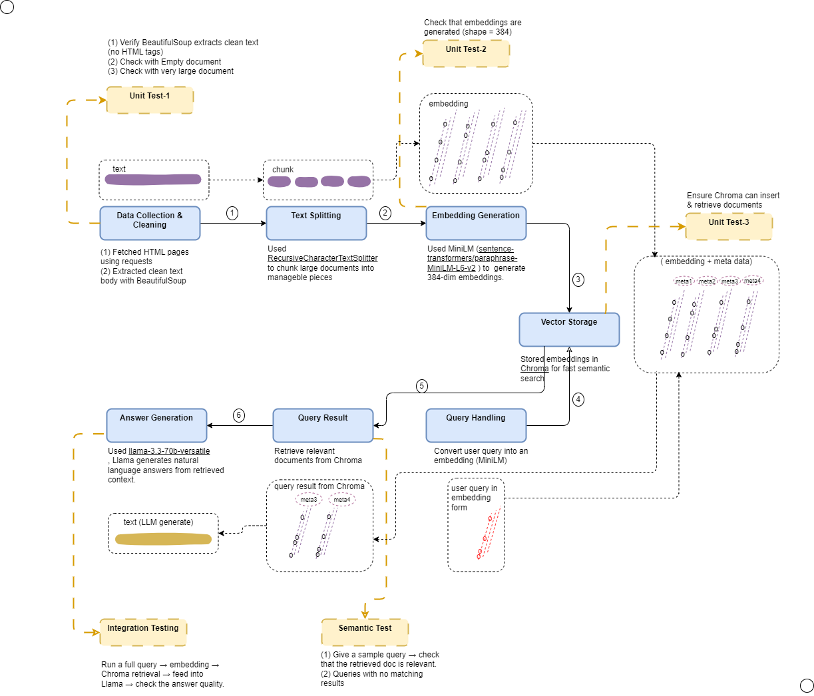

### Motivation & Need

Many people (including me) read newspaper **editorials and Guest Speaker's articles** for rich insights.  
However, when articles are written by top diplomats, policy experts, or academics, the English is often very sophisticated — making it difficult to quickly grasp the **core ideas**.  

This inspired me to build this app:  
- Users can enter a news article URL (e.g., from an editorial).  
- The app processes the article and stores it in a vector database.  
- Readers can then ask **simple questions** in plain English, and the app provides **clear answers** based on the article content.  

This way, complex articles become more **accessible, interactive, and easy to digest**.

➡️ At present, the app accepts and analyzes only **one article at a time**.  
Future enhancements will allow appending multiple URLs to the backend knowledge base, so users can query across a **collection of editorials** for a combined perspective.

---

### Why not ChatGPT?

Yes, ChatGPT can do this for a single article.  
But my app gives me **control over the knowledge base**:  
- I can keep adding editorials from diplomats.  
- Articles are stored permanently and can be queried later.  
- I can get a **combined, grounded view** across multiple articles.  

And equally important — this project gave me hands-on learning with **RAG pipelines, embeddings, and vector databases**.

---

## 📰 News Q&A App

This app allows a user to enter a **news article URL**.  
- The app scrapes and stores the article content.  
- Users can then ask **questions based on the article**, and the app will generate answers grounded in the news content.  

---

### Demo

#### Input
The user provides a (valid) news URL and a question:  


#### Output
After clicking **Get Answer**, the app displays the response:  


---

### Setup

1. To get started, first install the dependencies using:

    ```bash
    pip install -r requirements.txt
    ```

2. Run the Streamlit app from the project folder:

    ```bash
    streamlit run main.py
    ```

###  RAG Data Flow
This app is built using a **Retrieval-Augmented Generation (RAG)** pipeline:



**Steps:**
1. **Data Collection & Cleaning**  
   - Fetch HTML with `requests`.  
   - Extract clean text using **BeautifulSoup**.  
   - Split text into smaller chunks using `RecursiveCharacterTextSplitter`.  

2. **Embedding Generation**  
   - Use **MiniLM (`sentence-transformers/paraphrase-MiniLM-L6-v2`)** to generate 384-dim embeddings for each chunk.  

3. **Vector Storage**  
   - Store embeddings in **Chroma** along with metadata (URL, title, date, chunk ID).  

4. **Query Handling**  
   - Convert user query into embeddings.  

5. **Query Result**  
   - Retrieve top-k similar chunks from Chroma.  

6. **Answer Generation**  
   - Feed retrieved context + query into **Llama-3.3-70B Versatile (via Groq)**.  
   - Generate a natural-language answer.  

---

###  Testing
Before deployment, the pipeline was validated with:
- **Unit tests**: HTML extraction, embedding dimensions, Chroma insertion/retrieval.  
- **Integration tests**: Full pipeline from scraping → retrieval → answer generation.  
- **Semantic tests**: Ensured retrieved chunks matched expected relevance.  

---

### Requirements
All dependencies are pinned in 
[requirements.txt](requirements.txt)


**Key libraries include:**
- `streamlit`, `requests`, `beautifulsoup4`, `lxml`  
- `sentence-transformers`, `torch`, `huggingface-hub`  
- `langchain`, `langchain-community`, `langchain-groq`, `langchain-huggingface`  
- `chromadb`, `python-dotenv`  

---

### Future Improvements
- Support multiple URLs and batch ingestion.  
- Enrich metadata for better filtering.  
- Experiment with other embedding models and LLMs.  
- Add deployment option (e.g., Docker or cloud hosting).  
- Build a **persistent knowledge base** where editorials can be accumulated over time, allowing cross-article Q&A.  
